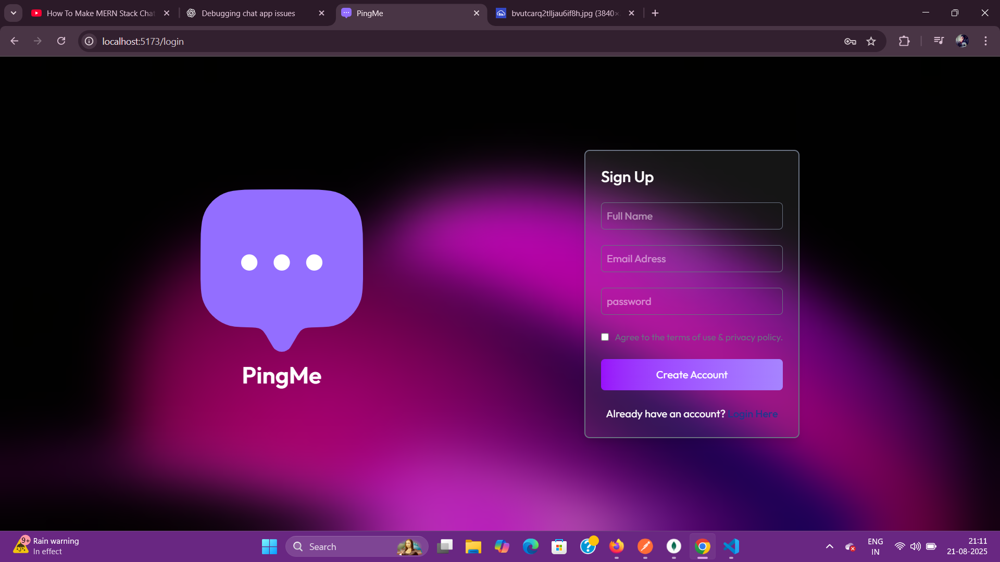
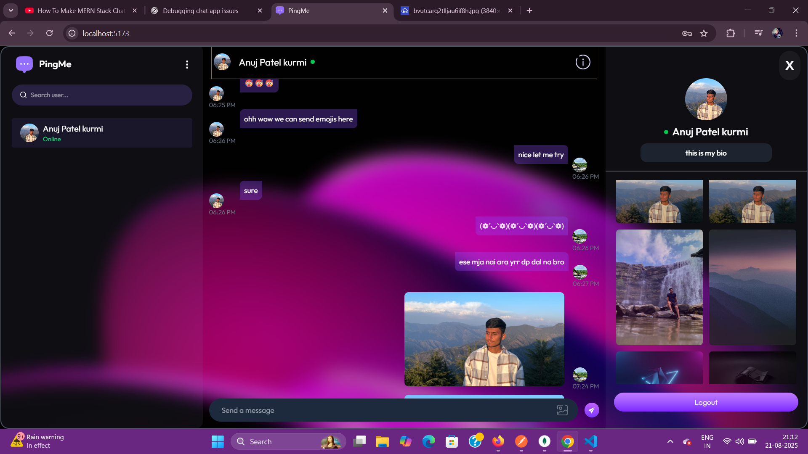
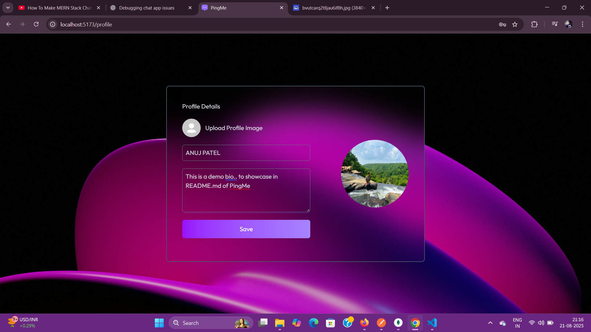

# Realtime Chat App 🚀

A realtime chat application built with **MERN + Socket.io** and deployed on **Vercel**.

## ✨ Features
- 🔐 User authentication (JWT-based)
- 💬 Realtime messaging with Socket.io
- 📸 Image sharing
- ✅ Online/offline status
- 📱 Responsive UI (mobile & desktop)

## 📂 Project Structure
/client # Frontend (React + Vite + Tailwind)
/server # Backend (Express + MongoDB + Socket.io)

bash
Copy code

## 🔧 Setup Instructions

### 1. Clone repository
```bash
git clone https://github.com/yourusername/chat-app.git
cd chat-app
2. Install dependencies
bash
Copy code
npm install
3. Configure environment
Create a .env file in /server:

ini
Copy code
MONGO_URI=your_mongodb_uri
JWT_SECRET=your_secret_key
CLOUDINARY_URL=your_cloudinary_url
4. Build & Run
bash
Copy code
# Backend
cd server
npm run build
npm start

# Frontend
cd client
npm run dev
5. Deploy
Push to GitHub

Connect repo to Vercel

Add environment variables in Vercel Dashboard

Deploy 🎉

###📸 Screenshots

### Login Page


### Chat Interface


### Profile Page



📝 License
MIT

